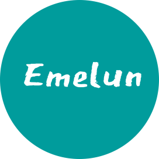

<br>

<p align="center">

</p>

<h1 align="center">IronUI-Admin</h1>

<p align="center">
    ['IronUI] أمل 希望
</p>
<p align='center'>一个 Mini 版的组件库，基于 Vite 栈。</p>

## Features

- ⚡️ Vue 3, Vite 2, pnpm, ESBuild - born with fastness
- 🦾 TypeScript, of course
- 🗂 File based routing
- ⚙️ Unit Testing with Vitest
- 😃 Eslint + Prittier
- 🎨 UnoCSS - the instant on-demand atomic CSS engine
- 🌍 I18n ready
- 🚘 CI/CD with GithubActions

## Install

```bash
npm i iron-ui
```

## Quick Start

```js
import Vue from 'vue'
import IronUI from 'iron-ui'

const App = {
  template: `<Button/>`,
}

createApp(App).use(IronUI).mount('#app')
```

## Browser Support

Modern browsers and Internet Explorer 10+.
